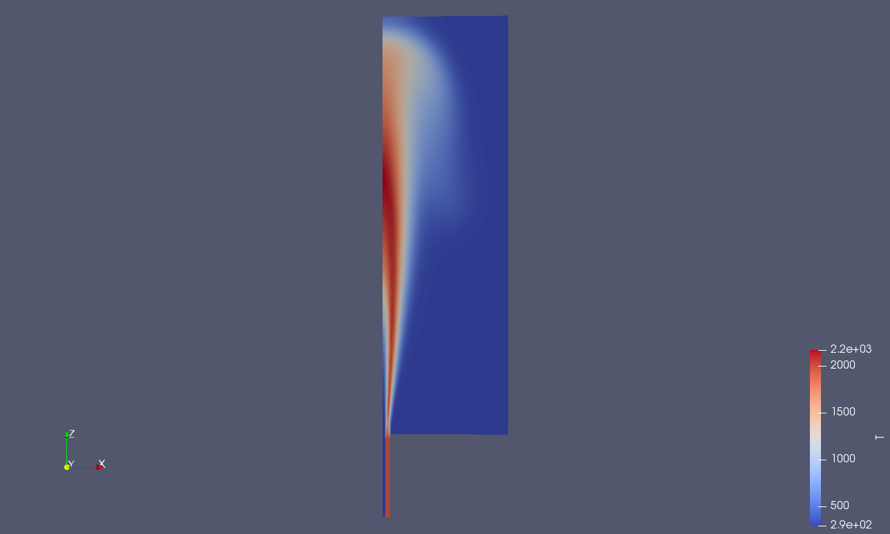
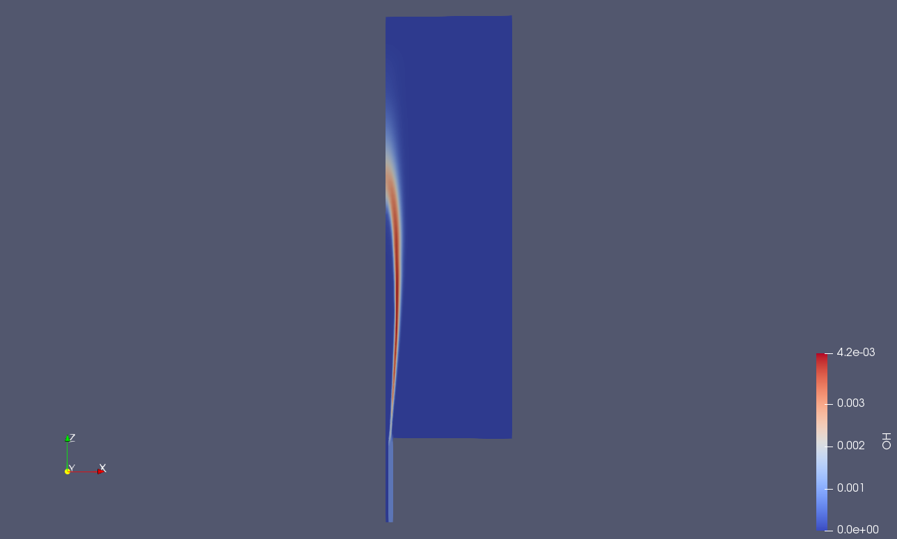

# Theory Manual: Premixed FGM Tables for OpenFOAM 7 `FGMFoam`

## Zero-variance progress-variable-variance execution path

**Document status:** validated implementation note for `FGMScripts_OF7_premixed_v6_zeroVarPV`  
**Solver target:** OpenFOAM 7 `FGMFoam`  
**Combustion formulation:** premixed CH₄/air flamelet-generated manifold (FGM)  
**Current validated mode:** `useProgressVariableVariance true` with `varPV = 0` and `varZ = 0`

> **GitHub rendering note:** This document uses GitHub-supported LaTeX math delimiters:
> `$...$` for inline mathematics and `$$...$$` for display equations.

---

## 1. Purpose

This manual documents the physical formulation, tabulation coordinates, OpenFOAM table interface, and current limitations of the premixed FGM database generated for the OpenFOAM 7 `FGMFoam` solver.

The original developer test case uses a premixed CH₄/air FGM database. A replacement workflow was developed that:

1. generates premixed Cantera `FreeFlame` solutions rather than counterflow diffusion flames;
2. constructs OpenFOAM-compatible lookup tables over mixture coordinate and scaled progress variable;
3. supplies the auxiliary moment tables required when `useProgressVariableVariance true`;
4. validates the solver's progress-variable-variance lookup path in the zero-variance limit.

---

## 2. Are the current tables 2D, 3D, or 4D?

The correct classification is:

> The current tables are **four-dimensional in storage and solver lookup interface**, but **two-dimensional in independent physical manifold content**.

### 2.1 Solver lookup dimensions

For the main FGM quantities, `FGMModel` constructs a four-entry lookup vector:

$$
\mathbf{x} =
\left[
\eta_{PV},\; c,\; \zeta_Z,\; Z
\right]
$$

where:

| Coordinate | Meaning | Current database status |
|---|---|---|
| $Z$ | unburned mixture coordinate / fuel-stream mass-fraction coordinate | physically resolved |
| $c$ | scaled progress variable | physically resolved |
| $\zeta_Z$ | normalized mixture-fraction variance coordinate | replicated zero-variance slices |
| $\eta_{PV}$ | normalized progress-variable variance coordinate | replicated zero-variance slices |

The OpenFOAM files therefore have the storage topology:

```text
FGM property tables: (PVeta, scaledPV, Zeta, Z) = (5, 51, 5, 51)
PV-bound tables:     (Zeta, Z)                 = (5, 51)
```

### 2.2 Physical content

The generated fields vary with:

$$
\Phi = \Phi(Z,c)
$$

They do not yet contain a physically integrated dependence on either variance coordinate:

$$
\Phi(Z,c,\zeta_Z,\eta_{PV})
=
\Phi(Z,c,0,0)
\quad \text{for all stored } \zeta_Z,\eta_{PV}
$$

The five variance slices exist to satisfy the older interpolation implementation and to permit the developer's `useProgressVariableVariance true` code path to execute in the zero-variance limit.

### 2.3 Classification table

| Table capability | Description | Present status |
|---|---|---|
| 2D physical FGM | $Z,c$ resolved | Implemented and validated by flame ignition |
| 3D physical FGM | $Z,c$ plus one nonzero variance dimension resolved | Not implemented |
| 4D physical FGM | $Z,c,\zeta_Z,\eta_{PV}$ all PDF-integrated/resolved | Not implemented |
| 4D OpenFOAM table interface | Four-index files readable by `FGMFoam` | Implemented |
| Zero-variance PVeta code path | `useProgressVariableVariance true`, with zero input variances | Implemented and algebraically validated |

---

## 3. Premixed FGM basis

### 3.1 Why premixed flamelets are required

The developer-supplied working database identifies itself as a premixed CH₄/air FGM table set. In the test case, a hot pilot initiates combustion in a premixed-reacting environment. A diffusion-flame database does not provide the same flame-propagation pathway in $(Z,c)$-space and was observed to leave the main domain unignited.

The current workflow therefore uses one-dimensional, freely propagating premixed flames:

```python
ct.FreeFlame(...)
```

for a set of unburned CH₄/air mixture coordinates $Z$.

### 3.2 Mixture coordinate $Z$

In the table-generation workflow, $Z$ is defined as the fuel-stream mass fraction in the unburned fuel/oxidizer mixture. For the present pure-methane fuel stream, this is equivalent to the unburned methane mass fraction:

$$
Z = Y_{\mathrm{CH_4},u}
$$

The case-specific default axis is:

$$
0 \le Z \le 0.1559
$$

and includes the pilot mixture coordinate:

$$
Z_{\mathrm{pilot}} = 0.04293
$$

These bounds are important: a table axis ranging from 0 to 1 would not reproduce the coordinate system used by this case.

---

## 4. Progress variable

### 4.1 Raw progress-variable definition

The patched table generator defines the unscaled progress variable in molar-per-mass units as:

$$
PV =
4\frac{Y_{\mathrm{H_2O}}}{W_{\mathrm{H_2O}}}
+
2\frac{Y_{\mathrm{CO_2}}}{W_{\mathrm{CO_2}}}
+
0.5\frac{Y_{\mathrm{H_2}}}{W_{\mathrm{H_2}}}
+
\frac{Y_{\mathrm{CO}}}{W_{\mathrm{CO}}}
$$

where $Y_i$ is mass fraction and $W_i$ is molecular weight. In the Python implementation, the resulting convention is documented as kmol/kg.

The included species and weights are:

```python
PV_WEIGHTS = {
    "H2O": 4.0,
    "CO2": 2.0,
    "H2":  0.5,
    "CO":  1.0,
}
```

### 4.2 Raw progress-variable source term

The volumetric source of the raw progress variable is calculated from Cantera net production rates:

$$
\dot{\omega}_{PV} =
4\dot{\omega}_{\mathrm{H_2O}}
+
2\dot{\omega}_{\mathrm{CO_2}}
+
0.5\dot{\omega}_{\mathrm{H_2}}
+
\dot{\omega}_{\mathrm{CO}}
$$

The `SourcePV_table` stores:

$$
W = \dot{\omega}_{PV}
$$

in the table generator's volumetric source convention.

### 4.3 Scaled progress variable

The solver transports unscaled `PV`, while table lookup uses a bounded scaled progress variable:

$$
c =
\frac{PV - PV_{\min}(Z,\zeta_Z)}
     {PV_{\max}(Z,\zeta_Z)-PV_{\min}(Z,\zeta_Z)}
$$

followed by clipping:

$$
0 \le c \le 1
$$

For the zero-variance table database:

$$
PV_{\min}(Z,\zeta_Z)=PV_{\min}(Z,0),
\qquad
PV_{\max}(Z,\zeta_Z)=PV_{\max}(Z,0)
$$

because the stored $\zeta_Z$ slices are replicated.

---

## 5. Variance coordinates in `FGMModel`

### 5.1 Mixture-coordinate variance

The solver computes the normalized mixture-fraction-variance coordinate as:

$$
\zeta_Z =
\operatorname{clip}
\left(
\frac{\widetilde{Z''^2}}
     {\max\left(\widetilde{Z}(1-\widetilde{Z}),\epsilon_s\right)},
0,\;0.99
\right)
$$

where the OpenFOAM field is `varZ` and the solver uses:

$$
\epsilon_s = 10^{-5}
$$

in the supplied `FGMModel.C`.

The current validated case maintains:

```foam
varZ
{
    internalField uniform 0;
}
```

Thus:

$$
\zeta_Z=0
$$

through the validated lookup path.

### 5.2 Progress-variable variance

When:

```foam
useProgressVariableVariance true;
```

the solver loads additional PV moment tables and calculates the variance of the scaled progress variable.

Define:

$$
Y_u = PV_{\min}, \qquad Y_b = PV_{\max}
$$

and moment quantities:

$$
f_c = \langle Y_u^2\rangle
$$

$$
g_c = \langle Y_uY_b\rangle-\langle Y_u^2\rangle
$$

$$
h_c =
\langle Y_b^2\rangle
-2\langle Y_uY_b\rangle
+\langle Y_u^2\rangle
$$

The solver calculates:

$$
\widetilde{c''^2}
=
\frac{
\widetilde{PV''^2}
+
\widetilde{PV}^2
-
f_c
-
2g_c\widetilde{c}
}
{\max(h_c,\epsilon_s)}
-
\widetilde{c}^2
$$

and then:

$$
\eta_{PV} =
\operatorname{clip}
\left(
\frac{\widetilde{c''^2}}
     {\max\left(\widetilde{c}(1-\widetilde{c}),\epsilon_s\right)},
0,\;0.99
\right)
$$

For the currently validated case:

```foam
varPV
{
    internalField uniform 0;
}
```

and the auxiliary table identities below enforce:

$$
\widetilde{c''^2}=0,
\qquad
\eta_{PV}=0
$$

up to numerical table precision.

---

## 6. Auxiliary tables for `useProgressVariableVariance true`

### 6.1 Tables loaded by the solver

When the switch is enabled, `FGMModel` loads three additional main tables:

```text
YWI_table
YuWI_table
YbWI_table
```

and three additional progress-bound tables:

```text
Yu2I_table
YuYbI_table
Yb2I_table
```

### 6.2 Zero-variance identities implemented in v6

For the current replicated zero-variance database:

$$
Y_u = PV_{\min}
$$

$$
Y_b = PV_{\max}
$$

$$
PV = Y_u + c(Y_b-Y_u)
$$

$$
W = \dot{\omega}_{PV}
$$

The auxiliary source quantities are:

$$
YWI = PV\,W
$$

$$
YuWI = Y_u\,W
$$

$$
YbWI = Y_b\,W
$$

The auxiliary moment quantities are:

$$
Yu2I = Y_u^2
$$

$$
YuYbI = Y_uY_b
$$

$$
Yb2I = Y_b^2
$$

These relations reproduce the algebraic zero-variance limit of the progress-variable-variance scaling implemented in `FGMModel.C`.

### 6.3 Meaning of the present implementation

The current implementation allows the original developer setting:

```foam
useProgressVariableVariance true;
```

to be used without changing the physical result from the verified 2D premixed baseline, provided:

```foam
varPV = 0;
varZ  = 0;
```

It does **not** create a physically broadened flame response under turbulent scalar variance.

---

## 7. Table contents and lookup structure

### 7.1 Main four-index tables

The following properties are written on the four-index FGM storage structure:

```text
T_table
psi_table
mu_table
alpha_table
SourcePV_table
YWI_table
YuWI_table
YbWI_table
```

Species tables may also be included, for example:

```text
CH4_table
O2_table
CO2_table
H2O_table
OH_table
N2_table
```

Their storage order is:

```text
(varPV_param, PV_param, varZ_param, Z_param)
```

or conceptually:

$$
(\eta_{PV}, c, \zeta_Z, Z)
$$

### 7.2 Two-index PV-family tables

The following are stored on:

```text
(varZ_param, Z_param)
```

or conceptually:

$$
(\zeta_Z,Z)
$$

Tables:

```text
PVmin_table
PVmax_table
Yu2I_table
YuYbI_table
Yb2I_table
```

### 7.3 Current axis dimensions

The validated table topology is:

```text
varPV_param: 5 values
PV_param:    51 values
varZ_param:  5 values
Z_param:     51 values
```

Thus:

```text
Main table topology: (5, 51, 5, 51)
PV table topology:   (5, 51)
```

---

## 8. Table-generation formulation

### 8.1 Flamelet generation

For selected values of $Z$, Cantera solves steady one-dimensional premixed flames using the specified mechanism, defaulting to:

```text
Mechanism: gri30.yaml
Fuel:      CH4:1
Oxidizer:  O2:0.21, N2:0.79
Tin:       294 K
Pressure:  101325 Pa
```

The default solved domain spans:

```text
Z = 0 to 0.1559
```

with an explicitly included pilot coordinate:

```text
Z = 0.04293
```

Only flammable solutions within the configured equivalence-ratio interval are solved as flames. Nonflammable/rich-end extensions are treated as zero-source thermochemical branches during table assembly.

### 8.2 Data extraction

Each accepted premixed flame contains a one-dimensional spatial profile. From each flame profile the generator extracts:

```text
T
rho
psi
mu
Cps
alpha
PV
SourcePV
species mass fractions
```

The raw premixed flame coordinate is then remapped to the scaled progress coordinate $c$.

### 8.3 Interpolation in $Z$ and $c$

The table builder constructs a uniform target table over:

$$
Z_i, \quad i=1,\ldots,51
$$

and:

$$
c_j, \quad j=1,\ldots,51
$$

using premixed flamelet data and endpoint extensions where a flamelet solution is not physically available.

### 8.4 Replication over variance axes

For the present version:

$$
\Phi(\eta_{PV,k},c_j,\zeta_{Z,l},Z_i)
=
\Phi(0,c_j,0,Z_i)
$$

for every stored variance index $k,l$. This is a deliberate compatibility and zero-variance-execution strategy, not presumed-PDF integration.

---

## 9. Validation evidence

### 9.1 Physical validation in the supplied test case

The initially generated diffusion-flame-based tables loaded successfully but did not ignite the main combusting region. After replacing them with the premixed table workflow, the test case produced a sustained hot reaction region and an OH-containing flame front.

Temperature result:



OH result:



### 9.2 Algebraic validation of the zero-variance PVeta path

The v6 validator checks:

1. presence of all tables required by `useProgressVariableVariance true`;
2. correct OpenFOAM table topology;
3. correct interpolation constructor names;
4. inclusion of zero on both stored variance axes;
5. exact replication of variance slices;
6. zero-variance auxiliary identities;
7. initial `varPV` and `varZ` internal fields equal to zero.

The resulting execution path is therefore validated for:

$$
\eta_{PV}=0,\qquad \zeta_Z=0
$$

not for nonzero variances.

---

## 10. What is needed for a true 3D or 4D FGM database?

### 10.1 True 3D extension

A true 3D table would resolve one nonzero variance coordinate in addition to $Z$ and $c$, for example:

$$
\Phi = \Phi(Z,c,\zeta_Z)
$$

This requires:

1. a physically meaningful `varZ` model in CFD;
2. presumed-PDF integration over mixture-coordinate fluctuations;
3. non-replicated `varZ_param` slices.

Alternatively, a progress-variable-only three-dimensional table would resolve $\eta_{PV}$ while retaining $\zeta_Z=0$.

### 10.2 True 4D extension

A true four-dimensional presumed-PDF database requires:

$$
\Phi = \Phi(Z,c,\zeta_Z,\eta_{PV})
$$

with:

1. nonzero `varZ` and `varPV` transport or closure models;
2. a selected presumed joint PDF or integration approximation;
3. PDF integration of every tabulated property, including `SourcePV` and auxiliary moments;
4. validation against laminar limits, zero-variance collapse, and turbulent combustion benchmarks.

### 10.3 Current solver-source constraint

In the supplied OpenFOAM 7 source, the base implementations of:

```cpp
correctVarZ()
correctChiZ()
correctChiPV()
correctVarPV()
```

are empty. A nonzero-variance modeling program therefore requires either:

- derived turbulence-model implementations not included in the present validated setup; or
- new solver/turbulence-model development to evolve these fields.

---

## 11. Recommended nomenclature for this release

For reports and repository documentation, describe this release as:

> **Premixed CH₄/air OpenFOAM 7 FGM database with four-dimensional solver-compatible storage and validated zero-variance progress-variable-variance lookup.**

Avoid describing it as a “true 4D FGM table” until the variance-axis slices are physically PDF-integrated and nonzero variance fields are modeled and validated.

---

## 12. Relevant implementation files

Within `FGMScripts_OF7_premixed_v6_zeroVarPV`:

| File | Role |
|---|---|
| `scripts/generatePremixedFlamelets.py` | Generates premixed Cantera `FreeFlame` solutions |
| `scripts/organizePremixedData.py` | Restores flamelets and extracts thermochemical/PV quantities |
| `scripts/fgm_common.py` | Defines mixture utilities, PV, and `SourcePV` |
| `scripts/buildPremixedFGMTables.py` | Builds $Z,c$ table archive and zero-variance auxiliary tables |
| `scripts/csv2of_tables.py` | Writes OpenFOAM 7 nested table files and property dictionaries |
| `scripts/validate_of7_premixed_tables.py` | Validates topology and zero-variance identities |
| `scripts/upgrade_existing_zero_variance_tables.py` | Adds auxiliary tables to an existing working premixed database |

Relevant supplied solver source files:

| File | Role |
|---|---|
| `src/combustionModels/FGMModel/FGMModel.C` | Table loading, PV scaling, variance-coordinate construction, lookup |
| `src/TurbulenceModels/turbulenceModels/turbulenceModel.C` | Base variance-correction function definitions |
| `applications/solver/FGMFoam/ZEqn.H` | Calls `correctVarZ()` |
| `applications/solver/FGMFoam/PVEqn.H` | Calls `correctVarPV()` |

---

## 13. Summary

The latest changes do not yet yield a physically complete 3D or 4D presumed-PDF FGM database. They provide:

- a physically correct **premixed 2D flamelet manifold** for this test case;
- the **four-dimensional table file shape** required by the OpenFOAM 7 implementation;
- the additional auxiliary tables required for the developer's `useProgressVariableVariance true` setting;
- a **validated zero-variance limit** in which the new execution path retains the working premixed flame solution.

This is the correct baseline before implementing nonzero scalar-variance transport and true PDF-integrated table construction.
